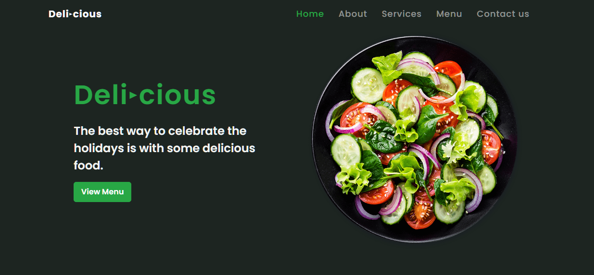

# restaurant-bootstrap-website

### Restaurant Bootstrap Website

Complete Restaurant Website with Bootstrap - HTML/CSS In this project.
Nice design of a responsive restaurant website 🥗 . It contains a header, home, about, services, menu, app, contact and a footer.

### You can see a live demo [here](https://ab-restaurant.netlify.app/).

 

  

